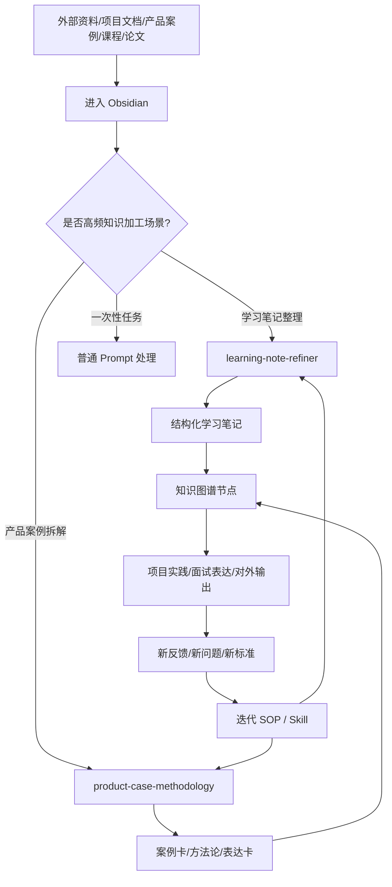

# 为什么要在 Obsidian 场景下做 Codex Skill 包

> 这篇文档解释的是：为什么在 Obsidian + Codex 的知识管理场景里，不应该只靠临时 Prompt，而应该把高频学习流程沉淀成 Skill。

---

## 1. 最初的需求不是“记笔记”，而是搭建知识资产系统

很多人一开始使用 Obsidian，会把它理解成一个笔记软件：

```text
看到资料
→ 复制进去
→ 建个文件夹
→ 偶尔搜索一下
```

但如果你的目标是长期学习、项目复盘、产品案例拆解、面试表达、个人知识图谱，那么 Obsidian 承担的就不只是“记录”功能。

更准确地说，Obsidian 是一个：

```text
个人知识图谱 + AI 工作台 + 方法论沉淀层
```

它要解决的是：

- 资料如何长期沉淀；
- 知识之间如何建立关系；
- 方法论如何从单篇笔记中抽象出来；
- 项目经验如何变成可复用表达；
- Agent 如何基于已有知识库协助思考；
- 重复学习流程如何变得稳定可控。

所以最初需求可以概括为一句话：

> 把分散的资料、项目、案例、论文、SOP 和个人经验，整理成一个可检索、可复用、可被 Agent 调用的知识系统。

---

## 2. Obsidian 解决的是知识承载，但不自动解决流程稳定性

Obsidian 很适合做知识资产层，因为它具备：

| 能力 | 价值 |
|---|---|
| Markdown 本地文件 | 数据自主、可迁移、不被平台锁死 |
| 双链 | 能显性表达知识之间的关系 |
| 文件夹 / 标签 / YAML | 方便分类、筛选、结构化管理 |
| Mermaid / Dataview | 可以做流程图、知识图谱、动态索引 |
| Agent 可读写 | Codex 可以直接读取、修改、整理笔记 |

但 Obsidian 本身不会自动告诉你：

- 一篇原始文章该怎么清洗？
- 一篇笔记该怎么去重、加摘要、加图谱？
- 一个产品案例该按什么框架拆？
- 哪些维度必须检查？
- 什么内容该沉淀成方法论？
- 什么内容该转成面试表达？

也就是说：

> Obsidian 能承载知识，但不会自动形成稳定的知识加工流程。

这就是为什么需要 Codex，也进一步需要 Skill。

---

## 3. 只靠临时 Prompt 的问题

如果每次都临时对 Codex 说：

```text
帮我整理一下这篇笔记。
```

或者：

```text
帮我分析一下这个产品案例。
```

它当然能做，但长期来看会出现几个问题。

| 问题 | 表现 |
|---|---|
| 输出不稳定 | 今天加了知识图谱，明天可能忘了加；这次拆了竞品，下次漏了风险 |
| 方法难复用 | 每次都要重新描述“我想要什么结构” |
| 经验难沉淀 | 你对框架的反馈不会自然进入下一次任务 |
| 知识难统一 | 不同笔记、不同案例格式不一致，后续很难检索和复习 |
| Agent 难协作 | Agent 每次都从当前 Prompt 开始，而不是从你的长期 SOP 开始 |

临时 Prompt 适合一次性任务，但不适合长期知识系统。

---

## 4. Skill 的本质：把方法论变成 Agent 可执行流程

Skill 不是简单的“提示词模板”。

更准确地说：

```text
Skill = 触发条件 + SOP + Checklist + 输出模板 + 参考资料
```

它的作用是把你反复使用的方法论，变成 Codex 可以稳定调用的能力。

例如：

```text
一次高质量任务
→ 复盘其中的高频步骤
→ 抽象成 SOP / Checklist / 模板
→ 写进 Skill
→ 后续类似任务稳定复用
→ 根据新反馈继续迭代 Skill
```

所以 Skill 是个人方法论的“可执行版本”。

| 普通方法论文档 | Skill |
|---|---|
| 写给人看 | 写给 Agent 执行 |
| 需要人每次记得使用 | 触发后自动按流程使用 |
| 容易停留在原则 | 会落实到输出结构和检查清单 |
| 反馈不一定沉淀 | 可以持续迭代进 Skill 文件 |

---

## 5. 什么场景适合做成 Skill？

不是所有任务都需要做成 Skill。

适合做成 Skill 的任务，一般满足四个条件：

| 条件 | 说明 |
|---|---|
| 高频 | 这个任务会反复出现，不是一次性需求 |
| 稳定 | 每次处理步骤大体相似 |
| 有标准 | 你知道什么样的输出算好 |
| 可迭代 | 每次任务后的反馈能继续优化流程 |

判断公式：

```text
是否适合做 Skill = 高频 × 流程稳定 × 输出标准明确 × 可持续迭代
```

典型适合做成 Skill 的场景：

- 学习笔记整理；
- 产品案例拆解；
- 论文阅读入库；
- 竞品分析；
- 面试表达卡生成；
- Bad Case 复盘；
- PRD 生成；
- 文章人味化修改；
- 知识图谱节点治理。

不适合做成 Skill 的场景：

- 一次性问题；
- 输出没有固定标准；
- 高度依赖临场判断且不可复用；
- 只是临时闲聊或探索性 brainstorm。

---

## 6. 为什么这个包先做四个 Skill？

这个 Skill 包目前保留四个核心 Skill：

```text
learning-note-refiner
product-case-methodology
obsidian-link-graph-builder
inbox-to-knowledge-graph
```

原因是它们对应四个最通用、最高频的知识加工场景：资料入库、笔记整理、案例拆解、知识图谱连接。

---

### 6.1 learning-note-refiner：从“资料”到“学习资产”

学习资料进入 Obsidian 后，如果不整理，它只是资料。

真正有价值的是把它加工成：

```text
顶部摘要
→ 一页速览
→ 知识图谱
→ 流程图
→ 模块化拆解
→ SOP / Checklist
→ 缺失信息与后续补充建议
```

这个流程非常高频。

你可能会用它处理：

- 原始文章；
- 课程笔记；
- 访谈稿；
- 会议纪要；
- 长 Markdown 文档；
- Obsidian 中写得比较散的学习笔记。

所以它适合做成 Skill。

它解决的问题是：

> 把原始资料变成可复习、可迁移、可沉淀的学习资产。

---

### 6.2 product-case-methodology：从“案例故事”到“产品判断力”

产品案例学习很容易变成“听故事”：

```text
这个产品做了什么？
它为什么火？
它有什么功能？
```

但真正有价值的是训练产品判断：

```text
它解决了谁的强痛点？
旧方案为什么不够？
竞品差异在哪里？
真实早期痛点是什么？
MVP 验证了什么？
增长飞轮怎么形成？
为什么别人难复制？
风险和反面启发是什么？
能怎么迁移到我的项目或面试表达？
```

这个拆解框架也非常高频。

所以它适合做成 Skill。

它解决的问题是：

> 把产品案例从“故事材料”加工成可复用的方法论、项目迁移和表达素材。

---

### 6.3 obsidian-link-graph-builder：从“孤立笔记”到“知识图谱节点”

笔记写完后，如果没有出链、链入和索引入口，很容易变成孤立文件。

这个 Skill 负责：

```text
读取当前笔记
→ 找到相关主题 / 案例 / 方法论 / 项目节点
→ 补充有意义的出链
→ 更新相关索引形成链入
→ 输出链接处理报告
```

它解决的问题是：

> 让新笔记稳定进入知识图谱，而不是散落在文件夹里。

---

### 6.4 inbox-to-knowledge-graph：从“收件箱资料”到“结构化节点”

资料丢进收件箱只是第一步。如果不处理，收件箱会很快变成文件垃圾堆。

这个 Skill 负责：

```text
保留原始资料
→ 判断资料类型
→ 清洗结构化
→ 生成知识节点
→ 更新索引
→ 必要时触发出链 / 链入
```

它解决的问题是：

> 让新资料从入口开始就进入知识治理流程。

---

## 7. 为什么不是一开始做很多 Skill？

在知识系统早期，不建议一次性做很多 Skill。

原因是：

1. Skill 太多会增加理解成本；
2. 很多流程还没有稳定，不适合过早固化；
3. 不同人的知识库结构不同，通用性有限；
4. 应该先找到最高频、最稳定、最能产生价值的场景。

所以这个包先保持轻量，只解决四个通用问题：

```text
1. 如何处理收件箱资料
2. 如何整理学习笔记
3. 如何拆解产品案例
4. 如何把新笔记接入知识图谱
```

其他能力，比如：

- 自动出链 / 链入；
- 收件箱资料自动入库；
- 论文阅读；
- Bad Case 复盘；
- 文章人味化；
- 事实准确性审查；

都可以后续按真实需求继续扩展。

原则是：

> 先用真实任务跑出稳定 SOP，再把 SOP 做成 Skill。

---

## 8. 从脑科学角度看：Codex、Obsidian 和 Skill 分别负责什么？

从脑科学和认知系统的角度看，这套系统不是在“让 AI 记住你的一切”，而是在搭建一个**外部认知系统**。

人脑更擅长目标判断、抽象、迁移、价值取舍；但不擅长长期保存大量细节、维护统一格式、稳定执行重复流程。于是可以把系统分工理解为：

| 组成 | 类比的大脑功能 | 负责什么 |
|---|---|---|
| 人 | 目标系统 / 元认知 / 价值判断 | 决定学什么、为什么学、什么值得沉淀、哪些结论可信 |
| Obsidian | 外部长期记忆 / 语义记忆网络 | 存放笔记、案例、项目、方法论，并用双链表达关系 |
| Skill | 程序性记忆 / 习惯回路 | 把高频流程固化成 SOP，让 Agent 稳定执行 |
| Codex | 执行脑 / 工作记忆扩展 / 前额叶助手 | 读取、整理、分析、重构、生成和执行具体任务 |
| RAG | 检索召回层 | 后续从大量高质量知识中召回相关内容 |

关键分工是：

```text
Obsidian 存知识
Skill 存流程
Codex 做执行
人做判断
```

---

### 第二大脑的四个核心原则

一个好的第二大脑，不应该只是某个 AI 产品里的隐式 memory，而应该是一个显性、可浏览、可编辑、可迁移的个人知识库。

#### 1. Explicit：记忆要显性

知识应该是可查看的，而不是藏在某个 AI 黑盒里。

你应该能看到：

- AI 知道你哪些项目；
- 哪些案例整理过；
- 哪些方法论已经沉淀；
- 哪些笔记之间有关联。

Obsidian 的 Markdown、双链、索引和图谱，让这个记忆 artifact 变得可检查、可管理。

#### 2. Yours：知识资产属于你

你的项目、案例、复盘、方法论，不应该只存在某个 AI 服务商的系统里。

它应该在你的本地文件中，可备份、可迁移、可导出。

#### 3. File over app：文件优先，而不是应用优先

知识最好沉淀在通用文件格式里，例如 Markdown、图片、PDF、脚本。

这样你可以用 Obsidian 查看，也可以用 Codex、Claude、本地工具、命令行脚本继续处理。

#### 4. BYOAI：Bring Your Own AI

当你的知识库是文件化、开放的，你就可以选择任何 AI 接入：Codex、Claude、OpenCode、本地模型，甚至未来新的 Agent。

真正属于你的不是某个 AI 的聊天记录，而是：

```text
你的知识库
你的方法论
你的 Skill
你的文件系统
```

---

### 为什么这比“AI 自动记住我”更可控？

| 隐式 AI 记忆 | 显性第二大脑 |
|---|---|
| 不知道它记住了什么 | 每篇笔记、每条链接都可查看 |
| 很难编辑和校正 | 可以直接修改 Markdown |
| 绑定某个平台 | 文件可迁移到任何工具 |
| 记忆结构不透明 | 文件夹、索引、双链、图谱都可见 |
| 难以复用到别的 AI | 任意 AI 都可以读取文件 |

所以这套方案的重点不是让某个 AI “神秘地更懂你”，而是让你拥有一个显性、可控、可迁移、可被不同 AI 调用的第二大脑。

---

## 9. Obsidian、Codex、Skill、RAG 的关系

这个体系里，每一层的作用不一样。

| 层级 | 作用 |
|---|---|
| Obsidian | 知识资产层：沉淀 Markdown、双链、索引、知识图谱 |
| Codex / Agent | 执行协作层：读取、整理、分析、生成、重构笔记 |
| Skill | 方法论执行层：把高频流程固化成稳定 SOP |
| RAG | 检索增强层：后续用于从高质量知识库中召回内容 |

所以我不是在做 Obsidian 和 RAG 二选一。

更准确的关系是：

```text
Obsidian：先把知识治理好
Skill：让 Agent 稳定加工知识
RAG：后续在需要问答和召回时接入
```

一句话：

> RAG 能帮你查到东西，但 Obsidian + Skill 能帮你形成体系。

---

## 10. 最终闭环



这套闭环的核心是：

```text
资料不是终点
笔记不是终点
Skill 也不是终点

真正的终点是：
知识能否被复用、迁移、表达、调用，并持续变得更好。
```

---

## 11. 对外表达版本

如果要简单讲给别人听，可以这样说：

> 我做 Obsidian + Codex Skill 包，是因为我发现长期学习里真正高频的不是“记笔记”，而是四类重复知识加工：收件箱资料入库、学习笔记整理、产品案例拆解、知识图谱连接。如果每次都靠临时 Prompt，输出会不稳定，也无法持续沉淀我的分析框架。所以我把这些场景做成 Skill，让 Codex 按固定 SOP 执行，再把结果回流到 Obsidian 的知识图谱里。这样 Obsidian 是知识资产层，Skill 是方法论执行层，Codex 是执行协作层，三者一起形成一个可持续学习和复盘的系统。

---

## 12. 一句话总结

> 在 Obsidian 场景下制作 Skill，不是为了多一个工具，而是因为长期学习中有些知识加工流程高频、稳定、可标准化、可迭代。把这些流程做成 Skill，才能让 Codex 不只是临时回答，而是按你的方法论持续帮你沉淀知识、训练判断、生成表达，并反哺个人知识图谱。
