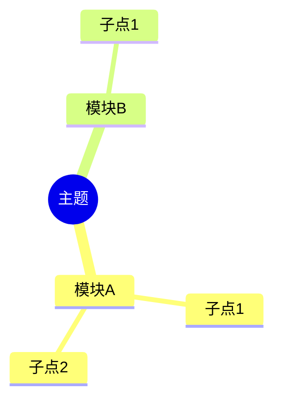
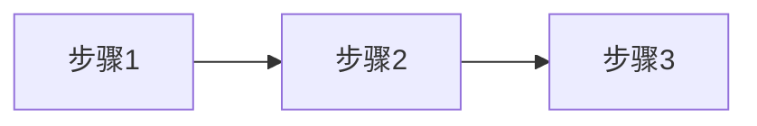
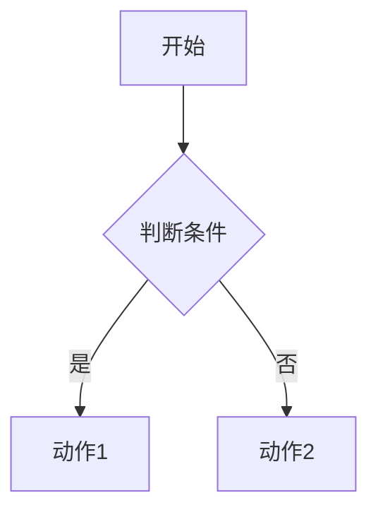
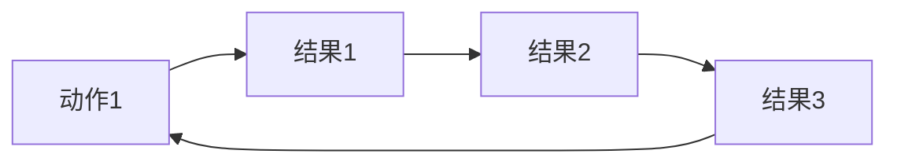
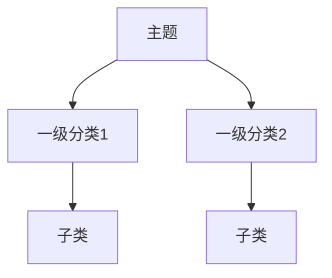

# Mermaid Diagram Patterns

## Mind map

```mermaid
mindmap
  root((主题))
    模块A
      子点1
      子点2
    模块B
      子点1
```

## Linear process

```mermaid
flowchart LR
    A[步骤1] --> B[步骤2]
    B --> C[步骤3]
```

## Decision flow

```mermaid
flowchart TD
    A[开始] --> B{判断条件}
    B -->|是| C[动作1]
    B -->|否| D[动作2]
```

## Flywheel

```mermaid
flowchart LR
    A[动作1] --> B[结果1]
    B --> C[结果2]
    C --> D[结果3]
    D --> A
```

## Tree-like hierarchy

```mermaid
flowchart TD
    A[主题] --> B[一级分类1]
    A --> C[一级分类2]
    B --> B1[子类]
    C --> C1[子类]
```
