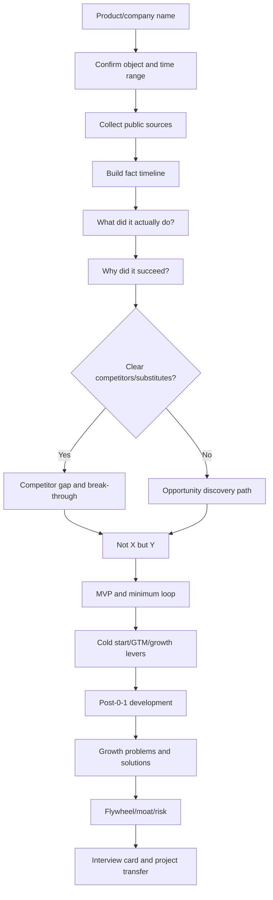

# Independent Product Case Decomposition SOP

Use this reference when the user gives only a product/company name, asks for an independent product拆解, or wants a full experience-pack style case.

## Mandatory six questions

Every full product case must answer:

| Question | Analyze | Weak answer | Strong answer |
|---|---|---|---|
| 1. What did it do? | Product form, target user, key workflow, business model, minimum loop | “It made an AI platform” | “It first delivered high-quality data labeling + QA for AV teams, then expanded to Data Engine/RLHF/evaluation” |
| 2. Why did it succeed? | Trend, pain, entry wedge, product mechanism, GTM/supply, data loop, team capability, timing | “It caught the trend” | “It captured the AI data bottleneck, picked high-paying customers, and productized human labeling into reliable data infrastructure” |
| 3. Compared with competitors, what did it capture? | Direct/indirect competitors, old workflows, customer-built substitutes, underserved segment/task | “It had better UX” | “Competitors were crowd/BPO or SaaS tools; it captured the need for outcome-responsible quality loops in complex AI data work” |
| 4. How did it evolve after 0-1? | Stage path from MVP to platform, scale, monetization, ecosystem, or strategic shift | “It got bigger” | “AV labeling → Data Engine → GenAI RLHF → SEAL evaluation → government/enterprise reliable AI” |
| 5. What problems appeared during growth? | Supply, quality, trust, monetization, regulation, customer concentration, competition, organization | “There were challenges” | “Meta investment created neutrality concerns; LLM data shifted toward expert reasoning; labeling risked commoditization” |
| 6. How did it solve them? | Productization, operations, governance, trust mechanism, quality system, strategic move upmarket | “It optimized product” | “Data separation statements + SEAL + GenAI Platform + Donovan + reliable AI positioning moved it up the value chain” |

Short rule: **restore actions → explain success → compare competitors → extract cognitive difference → cover 0-1 and 1-10 → name problems → name solutions.**

## Workflow



## Sources to collect

Prioritize:
1. Official website, product pages, blogs, pricing, docs, financial reports, S-1/annual reports.
2. Founder/executive interviews for original opportunity insight and tradeoffs.
3. Customer cases, screenshots, help docs, job posts for actual product/workflow evidence.
4. Reputable media/research for competitors, market changes, controversies, and risks.
5. Competitors' own websites/docs, not only third-party commentary.

Rules:
- Separate **fact / public report / inference / unknown**.
- For current entities, verify recent CEO, product line, funding, customers, regulation, and competitors with current sources.
- Do not overcommit to unverified numbers; use “public reports mention…” when needed.

## Competitor/substitute branch

If there are competitors or substitutes, analyze:

| Dimension | Questions |
|---|---|
| Competitors | Direct products, indirect substitutes, old workflow, customer-built solution |
| Existing value | Why users already used them; what they solved well |
| Gap | What user/scenario/task/cost/trust issue remained underserved |
| Break-through | Product, operation, supply, pricing, channel, data, trust, or timing difference |
| Hard to copy | Would copying hurt the incumbent's positioning, economics, org, or ecosystem? |
| Proof | Early customers, retention, willingness to pay, repeated use, or public traction |

Template:

> It was not a blank market. Users already used 【substitutes】 for 【existing job】, but those solutions failed in 【underserved scenario】 because 【structural gap】. The product broke through by choosing 【entry wedge】 and creating 【mechanism】, which competitors could not easily copy because 【reason】.

## No-obvious-competitor branch: opportunity discovery（only when truly no competitor/substitute）

Use this branch only when direct competitors, substitutes, customer self-build, manual workflows, agencies, open-source tools, or doing-nothing alternatives truly cannot explain the case. If competitors/substitutes exist, do not include this branch in the final case. Analyze:

| Dimension | Questions |
|---|---|
| Technology shift | What became newly possible? |
| User behavior shift | What new habit, expectation, or workflow emerged? |
| Cost shift | Which cost dropped or constraint changed? |
| Infrastructure gap | Did a new industry lack AWS/Stripe/Twilio-like primitives? |
| Founder pain | Did the founder personally hit a repeated bottleneck? |
| Repeated inefficiency | Were many teams reinventing the same wheel? |
| Undervalued link | Which “dirty/boring” link actually determined final results? |
| Why now | Why did the window open then, not earlier? |
| First users | Who was most painful, urgent, and willing to try/pay? |

Template:

> With no obvious direct competitor, I would dissect the opportunity path: 【trend】 created a new need, but teams were repeatedly blocked by 【bottleneck】. The founder/market discovered that this was not a one-off pain but an industry-level gap. The first wedge was 【high-pain user/scenario】 because it had urgency, budget, and proof value.


## Product construction path when competitors exist

When competitors/substitutes exist, the case should not say “no obvious competitor.” Instead, reconstruct how the product was built from demand to solution:

```text
market/technology change → customer task → core bottleneck → old solution gap → entry customer/scenario → product scheme → MVP loop → landing/operations → productized mechanism → expansion
```

Key questions:

| Step | Questions |
|---|---|
| Market demand | What changed in the market/technology/user workflow? |
| Customer task | What job is the customer trying to complete? |
| Core bottleneck | What blocks the task from progressing? |
| Old solution gap | Why do self-build, competitors, agencies, tools, or manual workflows fail? |
| Product scheme | What system design solves the bottleneck better than a point solution? |
| MVP loop | What minimum loop proves the scheme works? |
| Landing | What manual operations are needed first? |
| Productization | Which manual operations become rules, workflows, dashboards, tooling, or data flywheels? |
| Expansion | Which adjacent customer/scenario becomes possible after the first loop works? |

Template:

> This case had competitors/substitutes, so I would not frame it as no-competitor opportunity discovery. I would reconstruct the product-building logic: 【market change】 created 【customer task】, but 【old solutions】 failed at 【core bottleneck】. The product chose 【entry wedge】, designed 【product scheme】, verified it with 【MVP loop】, then productized 【manual/operational mechanism】 into 【repeatable system】.

## Success attribution layers

Never reduce success to “trend.” Cover:

| Layer | Questions |
|---|---|
| Trend | What technology/market/channel/regulatory shift opened the window? |
| Pain | Which pain had high urgency, frequency, cost, or willingness to pay? |
| Entry wedge | Why this segment/scenario/task first? |
| Mechanism | What mechanism changed behavior or efficiency? |
| GTM/supply | How did first users, supply, content, data, or channels arrive? |
| Feedback loop | What data/network/content/supply loop compounded? |
| Capability | What team/resource/partnership/technical/operational advantage mattered? |
| Timing | Why now, not years earlier? |

## Post-0-1 development and problems

Full cases must continue past first success:

| Stage | Analyze | Common problems | Solutions |
|---|---|---|---|
| 0-1 | MVP, first users, minimum loop | False demand, weak supply, channel access | Manual wedge, atomic market, tight feedback |
| 1-10 | Repeat to more users/markets | Manual work does not scale, quality variance | SOP, tooling, dashboards, productization |
| 10-100 | Platform/commercialization/org | Costs, inconsistent experience, trust risk, copycats | Rules, governance, QA systems, brand/ecosystem |
| Strategic shift | New tech/market | Core business commoditized, customers change | Move up value chain, migrate capabilities |
| Mature stage | Multi-business/international/ecosystem | Customer concentration, regulation, neutrality, complexity | Compliance, data isolation, org layers, risk governance |

Stage table template:

| Stage | What it did | Problem encountered | How it solved it | PM lesson |
|---|---|---|---|---|
| 0-1 |  |  |  |  |
| 1-10 |  |  |  |  |
| 10-100 |  |  |  |  |
| Shift/new era |  |  |  |  |

## Standard full-case outline

```markdown
# Product name from 0-1: PM case decomposition

## One-sentence summary
## Public facts snapshot
## What PM capability this case strengthens
## Knowledge graph
## Full flow chart

# 1. Opportunity discovery / demand insight
# 2. What it did: product form and minimum task
# 3. Competitor landscape, old-solution gap, and product construction path
# 4. Cognitive difference: not X, but Y
# 5. MVP and minimum loop
# 6. Why it succeeded: multi-factor attribution
# 7. Cold start / GTM
# 8. Post-0-1 development path
# 9. Problems during growth and solutions
# 10. Growth levers and data/business flywheel
# 11. Business model and moat
# 12. Risks and reverse lessons
# 13. Comparison with existing case library
# 14. Transfer to the user's GEO / Agent projects
# 15. Interview-ready summary
# 16. Sources and confidence notes
```

## Quality checklist

- [ ] Latest public facts checked when facts may have changed.
- [ ] Facts, reports, inference, and unknowns are separated.
- [ ] “What it did” is concrete, not category-level.
- [ ] “Why it succeeded” is multi-factor, not “trend.”
- [ ] Competitors/substitutes are analyzed. If they exist, no “no competitor” branch is included; instead, market demand → product scheme → MVP/landing path is explicit. If none truly exist, opportunity discovery path is explicit.
- [ ] “Not X, but Y” is clear.
- [ ] MVP and minimum loop are reconstructed.
- [ ] Cold start and first users/supply/GTM are explained.
- [ ] Post-0-1 development path is covered.
- [ ] Growth-stage problems and solutions are named.
- [ ] Flywheel, moat, risks, and reverse lessons are included.
- [ ] Interview card and project-transfer expression are produced.
